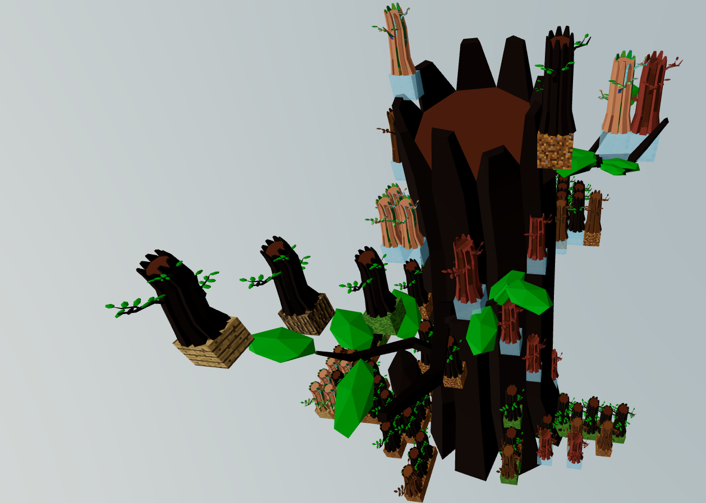

# Abble

## 팀 이름 소개

3D 메타버스 공간에서 NFT를 통해 경제 활동을 한다는 컨셉으로, 가장 대중적인 과일 나무인 사과인 Apple과 Block을 결합해서 Abble 이라는 이름을 지었습니다.

## 팀 이름

| 이름 | 역할 | 소개 |
| --- | --- | --- |
| 곽민수 | 팀장 & 백엔드 | Rest API, Socket, 배포 |
| 반민성 | 프론트 리드 | three.js로 메타버스 환경 구축 |
| 양환히 | 기획 & 백엔드 | Growing NFT 기획 및 스마트컨트랙트 작성 |
| 황상진 | 프론트 | three.js로 메타버스 환경 구축 |

## 프로젝트 주제

Growing NFT

## 프로젝트 컨셉

### 프로젝트 목표

인간의 의식주를 NFT를 통해서 구현하고, 차츰 진화하는 사회의 모습을 NFT를 통해서 구현하고자 함

### 프로젝트 스토리

망해가는 지구에서 살아남기 위해 지하세계를 만들어낸 Abble. 땅을 가꾸고, 수렵/채취 등을 통해서 차츰 사회의 모습을 만들어 가는데...

#### Phase 1: 농업
#### Phase 2: 축산업
#### Phase 3: 임대업

## 프로젝트 구성 설명

크게 메타버스, 스마트컨트랙트, 소켓 통신을 위한 서버 구성 총 3가지 구성 요소로 프로젝트가 진행될 예정입니다.